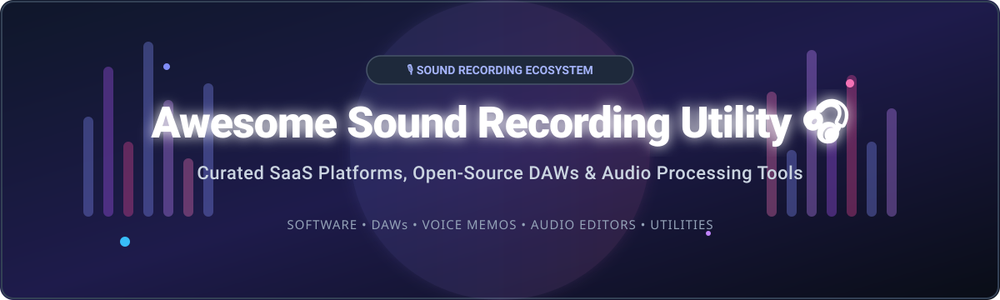

# 🎙️ Awesome Sound Recording Utility 🎧

  
  
  
  

## 🌟 Top Sound Recording & Audio Editing Utility Ecosystem

> **A Curated List of SaaS Products & Open-Source GitHub Projects**  
> *Focused on Audio Recording, Digital Audio Workstations (DAWs), Voice Recorders & Open-Source Audio Processing Workflows.*  
> **Last updated: October 2026**

---

This repository tracks notable **commercial audio recording software**, **cloud SaaS platforms**, and **open-source GitHub projects** that capture, edit, process, and master sound — from lightweight voice memo tools to professional digital audio workstations and command-line processing utilities.

---

## 📑 Table of Contents
- [🌐 SaaS & Hosted Audio Platforms](#-saas--hosted-audio-platforms)
- [⚡ Open-Source GitHub Projects](#-open-source-github-projects)
- [🤝 How to Contribute](#-how-to-contribute)
- [💖 Support & Sponsorship](#-support--sponsorship)
- [⚠️ Disclaimer](#-disclaimer)
- [⭐ Star History](#-star-history)

---

## 🌐 SaaS & Hosted Audio Platforms

### 📊 Market Analysis & Overview
> **Market Size & Structure**: The global audio recording, editing software, and DAW market is estimated at **$3.8 Billion - $4.5 Billion** (2025/2026), growing at a ~9.2% CAGR driven by podcast growth, streaming content creation, and remote audio production.  
> **Market Fragmentation**: The commercial sector is **moderately fragmented**. Apple and Adobe command dominant positions in general creative suites, while specialized niche audio vendors (NCH Software, MAGIX) capture targeted commercial desktop utility segments.

Below is a comparison of top commercial sound recording and audio workstation software, sorted in descending order by company valuation / revenue.

| 🏢 Product | 💵 Pricing (Starting Tier) | 🎁 Free Tier / Free Trial Limit | 💰 Company Valuation / Revenue | 📝 Highlights & Best Use Case |
| :--- | :--- | :--- | :--- | :--- |
| **[GarageBand](https://www.apple.com/mac/garageband/)** | **Free** (Included with macOS/iOS) | **Unlimited** free full version for Apple users | **$4.9 Trillion** valuation / ~$416B annual revenue (Apple Inc.) | Beginner-friendly DAW with virtual instruments & multitrack podcast recording. |
| **[Adobe Audition](https://www.adobe.com/products/audition.html)** | **$22.99 / month** (Single App Plan) | **7-Day Free Trial** (Full access; requires credit card registration) | **$92.5 Billion** market cap / ~$23.7B annual revenue (Adobe Inc.) | Industry-standard spectral audio restoration, noise reduction, and multitrack mixing. |
| **[Sound Forge](https://www.magix.com/us/music/sound-forge/)** | **$39.99 / year** (or $59.00 one-time) | **30-Day Free Trial** (Full functional trial) | **~$50M - $100M** estimated revenue (MAGIX Software GmbH) | Ultra-precise waveform editing, mastering tools, and batch audio file processing. |
| **[WavePad](https://www.nch.com.au/wavepad/)** | **$5.50 / month** (or $60.00 Standard license) | **14-Day Free Trial** of Master's Edition; basic edition free for non-commercial home use | **~$7M - $15M** ARR (NCH Software / Solenis) | Lightweight audio editor with voice recording, quick clipping, and basic VST plugins. |
| **[RecordPad](https://www.nch.com.au/recordpad/)** | **$7.49** (One-time license purchase) | **14-Day Free Trial** (Full feature access during trial) | **~$7M - $15M** ARR (NCH Software / Solenis) | Dedicated lightweight voice & sound recorder for fast dictation and background capture. |

---

## ⚡ Open-Source GitHub Projects

Audio recording and editing is one of the strongest open-source software ecosystems. Projects like **FFmpeg**, **Audacity**, **MuseScore**, and **Ardour** power millions of creators, audio engineers, and developers worldwide.

The projects below are sorted by their GitHub Stars_Count in descending order.

| 📦 Project | 🏷️ Stars_Badge (Stargazers Link) | 📜 License | 🎯 Category & Primary Features |
| :--- | :--- | :--- | :--- |
| **[OBS Studio](https://github.com/obsproject/obs-studio)** |  | GPL-2.0 | **Live Audio/Video Recording & Streaming**. Supports multi-track audio routing, noise suppression (RNNoise/Speex), and VST plugin filters. |
| **[FFmpeg](https://github.com/FFmpeg/FFmpeg)** |  | LGPL/GPL | **The Swiss-Army Multimedia Framework**. Command-line audio capture, format conversion, filtering, streaming, and audio extraction pipeline. |
| **[Audacity](https://github.com/audacity/audacity)** |  | GPL-2.0 | **De Facto Open-Source Audio Editor**. Cross-platform multitrack recording, spectral selection, noise reduction, and VST3/AU/LV2 plugin support. |
| **[MuseScore](https://github.com/musescore/MuseScore)** |  | GPL-3.0 | **Music Notation & Audio Composition**. Professional sheet music engraver with audio playback engine, soundfont recording, and MIDI export. |
| **[AudioKit](https://github.com/AudioKit/AudioKit)** |  | MIT | **Swift Audio Synthesis & Recording Framework**. Empowering iOS/macOS audio apps with real-time sound processing, recording, and analysis. |
| **[LMMS](https://github.com/LMMS/lmms)** |  | GPL-2.0 | **Cross-Platform Digital Audio Workstation**. Beatmaking, pattern sequencing, virtual instruments, and FL Studio-style music creation. |
| **[Mixxx](https://github.com/mixxxdj/mixxx)** |  | GPL-2.0 | **DJ Software & Live Performance Recording**. Real-time master audio output recording, vinyl control, multi-channel mixing, and EQ tools. |
| **[SuperCollider](https://github.com/supercollider/supercollider)** |  | GPL-3.0 | **Audio Synthesis Environment & Sound Engine**. Programming language for algorithmic music composition, live coding, and audio recording. |
| **[Ardour](https://github.com/Ardour/ardour)** |  | GPL-2.0 | **Professional Open-Source DAW**. Complete Pro Tools alternative featuring non-destructive editing, unlimited tracks, MIDI sequencing, and mixing console. |
| **[BespokeSynth](https://github.com/BespokeSynth/BespokeSynth)** |  | GPL-3.0 | **Modular DAW & Sound Lab**. Visual node-based audio synthesizer, custom sound routing, and live loop recorder. |
| **[Helio Workstation](https://github.com/helio-fm/helio-workstation)** |  | GPL-3.0 | **Lightweight Linear Music Sequencer**. Minimalist cross-platform DAW focused on clean composition, MIDI recording, and audio export. |
| **[Zrythm](https://github.com/zrythm/zrythm)** |  | AGPL-3.0 | **Modern Automated DAW**. Highly automatable digital audio workstation written in C/GTK4 with automations, chord assistant, and LV2 support. |
| **[JACK2](https://github.com/jackaudio/jack2)** |  | GPL-2.0 | **Low-Latency Audio Connection Kit**. Professional audio server infrastructure for interconnecting audio recording software and hardware. |
| **[Pure Data](https://github.com/pure-data/pure-data)** |  | BSD-3-Clause | **Visual Programming Environment for Multimedia**. Real-time audio processing, synthesizer creation, and audio stream capture. |
| **[SoX (Sound eXchange)](https://github.com/chirlu/sox)** |  | GPL-2.0 | **CLI Sound Processing Utility**. The classic command-line tool for audio format conversion, concatenation, and audio effects. |
| **[Tenacity](https://github.com/tenacityteam/tenacity)** |  | GPL-2.0 | **Privacy-Focused Audacity Fork**. Telemetry-free audio recording and editing tool created by the community. |
| **[Qtractor](https://github.com/rncbc/qtractor)** |  | GPL-2.0 | **Qt-based Multi-track Sequencer**. Lightweight Linux DAW for audio and MIDI recording and editing. |

---

## 🤝 How to Contribute

We welcome community contributions! Follow these steps to submit new sound recording tools or updates:

1. **Fork the Repository**: Click the `Fork` button at the top right of this repository.
2. **Add Entry**: Update `README.md` following the table formatting (ensure links, licenses, and specific pricing/stars details are included).
3. **Check Guidelines**:
   - For **SaaS**: Provide explicit starting tier prices and exact free trial / free tier limits.
   - For **Open Source**: Include official GitHub repo link and license.
4. **Submit PR**: Open a Pull Request with a short summary of your additions.

---

## 💖 Support & Sponsorship

If you find this curated list of sound recording utilities helpful, please consider supporting the project! Your encouragement keeps this list updated and maintained.

- ⭐ **Star this repository** to increase visibility.
- 🔀 **Fork & Share** with fellow podcasters, audio engineers, and developers.
- ☕ **Sponsor the Maintainer**: Buy us a coffee via the [GitHub Sponsor Dashboard](https://github.com/sponsors/ishandutta2007).

---

## ⚠️ Disclaimer

- This list is **community-curated** for informational and educational purposes.
- Audio recording utilities handle potentially sensitive microphone and audio data. Always review privacy settings and telemetry options before deployment.
- Pricing details, free trial terms, and Stars_Counts are regularly refreshed but may change over time according to software vendors.

---

## ⭐ Star History

---

  <b>Made with ❤️ for podcasters, musicians, audio engineers, and sound enthusiasts.</b>

